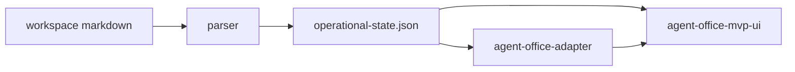

# Instalogist Agent Office MVP

This document describes the **read-only** MVP that surfaces **live operational tasks** from `instalogist-operational-state-1` inside an **Agent Office–styled** UI. It is **not** the upstream Agent Office monorepo panel; the full `instalogist/agent-office` checkout is optional for future integration.

## Goals

- **Operational visibility first:** Kanban lifecycle, incidents, ownership, escalation and stale signals, degraded warnings.
- **No feature creep:** No editing, no autonomous behavior, no AI-driven task mutations, no production CutUp wiring.
- **Single source of truth:** Browser loads `operational-state.json`; the UI runs **`adaptOperationalToAgentOffice`** from `@instalogist/agent-office-adapter` so rendering matches the **`instalogist-agent-office-ui-1`** contract.

## Components

| Piece | Role |
|--------|------|
| Parser | Produces `operational-state.json` (`instalogist-operational-state-1`). |
| `@instalogist/agent-office-adapter` | Pure transform: operational state → `AgentOfficeUiModel`. |
| `instalogist/agent-office-mvp-ui` | Vite + React app: fetch JSON, adapt, render (port **5175** by default). |
| `instalogist/command-center` | Alternate consumer of the same snapshot (different layout/features). |

## Data flow

The MVP UI **always** adapts in the browser after fetch, so the displayed model includes a fresh **`adapted_at`** timestamp even when the snapshot file is unchanged.

## Running locally

From repo root (or `instalogist/agent-office-mvp-ui`):

1. Build the adapter (automatic via `predev` / `prebuild` hooks, or run manually):

   `npm run build --prefix instalogist/agent-office-adapter`

2. Install and start the MVP UI:

   `cd instalogist/agent-office-mvp-ui && npm install && npm run dev`

3. Place or generate **`public/operational-state.json`** (or set **`VITE_OPERATIONAL_STATE_URL`** to a URL returning the same contract).

Example: regenerate from workspace with the parser (see `instalogist/parser/README.md`).

## UI behaviors (MVP)

- **Refresh:** Triggers a new `fetch` + adapt cycle (`cache: 'no-store'`).
- **Timestamps:** Header shows **`source.generated_at`**, **`adapted_at`**, and **last successful fetch** time.
- **Parser / adapter banner:** `snapshot_status`, contract id, parser version, adapter warning count.
- **Summary banner:** Derived **`views.summary.banner`** (`ok` | `degraded` | `critical`).
- **Visual signals:** `risk_class`, `priority`, parse health (`parse_status` + validation counts), escalation (`escalation.reason` on board cards), stale / `blocked_stale`.

## Relationship to upstream Agent Office

The directory `instalogist/agent-office` may be a **sparse or partial** clone. The MVP UI is a **standalone** host for the adapter contract until a full Agent Office workspace is available. At that point, the same `AgentOfficeUiModel` (or equivalent React views) can be **mounted** inside the real Agent Office shell with minimal duplication.

## Explicit non-goals

- Mutating tasks or YAML from the browser.
- Background polling, webhooks, or “agent” automation.
- Authenticated or production CutUp admin APIs.

## Contract references

- Input: `instalogist-operational-state-1` (parser).
- Output: `instalogist-agent-office-ui-1` (adapter types in `instalogist/agent-office-adapter`).
